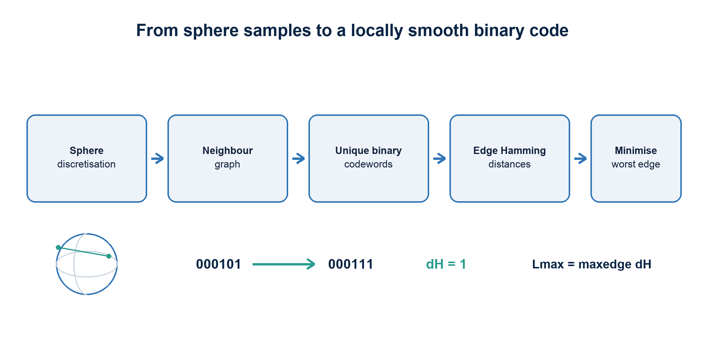
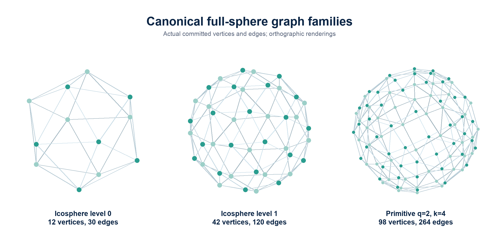
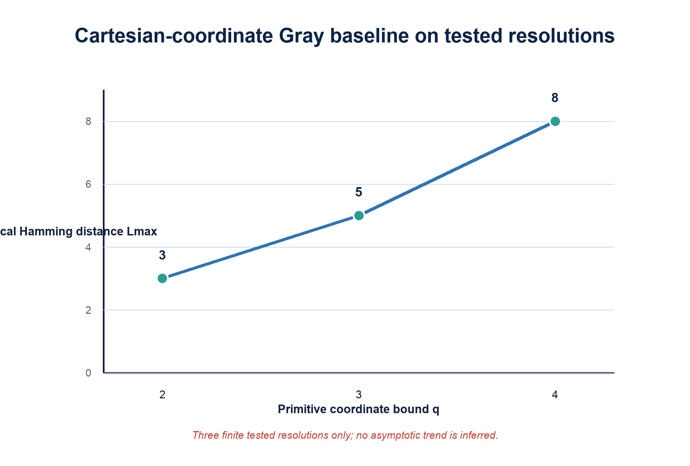
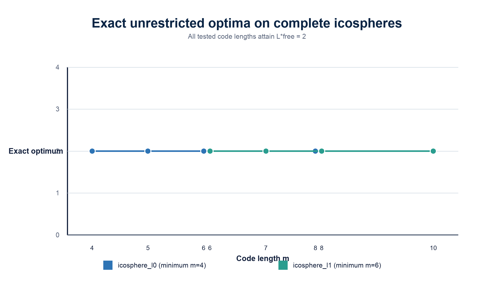
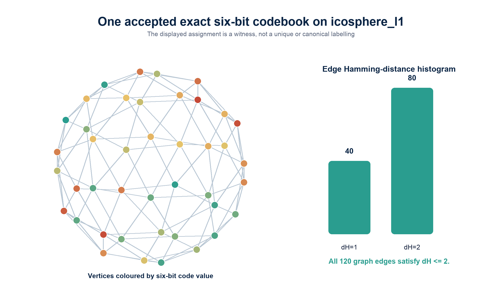
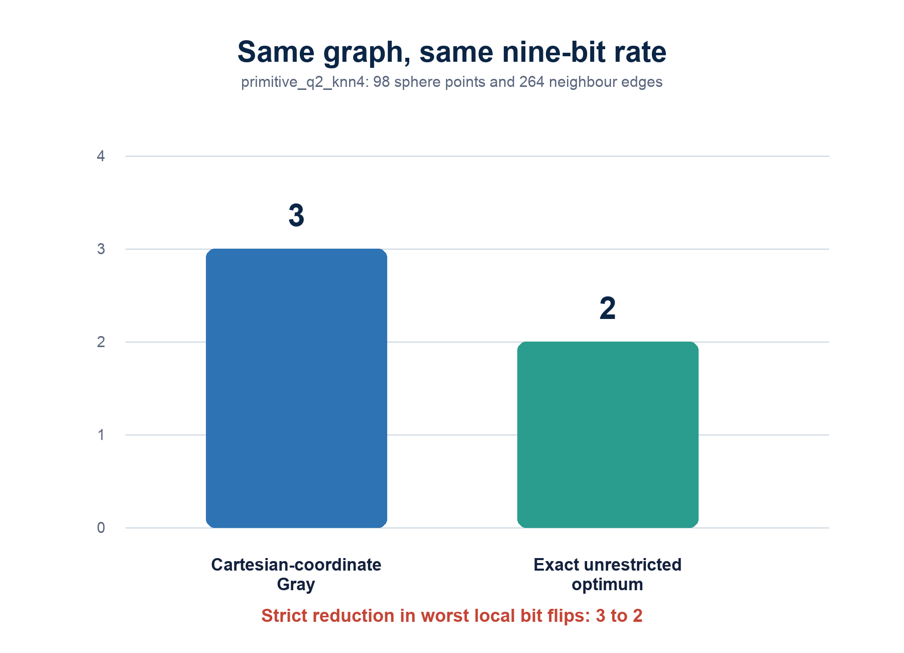
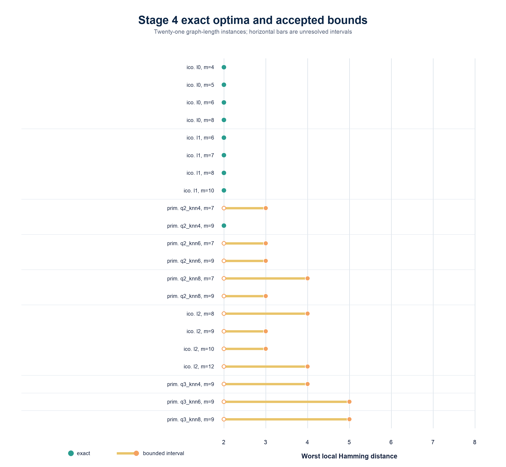
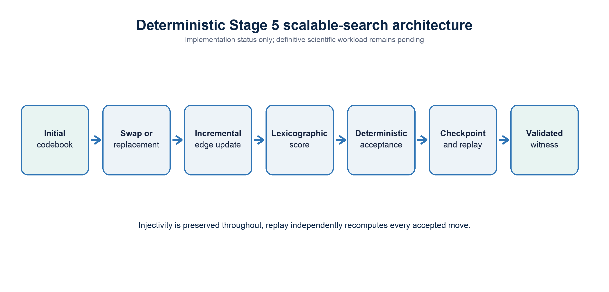

# Beyond Cartesian Gray Codes

## Exact and Scalable Search for Locally Smooth Binary Encodings of the Sphere

**Interim research report**  
**Status date:** 26 July 2026  
**Scientific scope:** accepted Stages 2-4 and current Stage 5 implementation status

---

## Abstract

This project asks whether a finite discretisation of the unit sphere can be assigned unique binary words whose *worst local bit change* is smaller than that of a matched Cartesian product of binary-reflected Gray codes. A sphere point set is represented by an undirected neighbour graph; an injective assignment of (m)-bit words is scored by the largest Hamming distance over graph edges. Deterministic baselines were evaluated on complete icosphere triangulations and on primitive integer directions with tie-complete symmetric nearest-neighbour graphs. Exact unrestricted codebook optimisation was then formulated as a sequence of CP-SAT threshold-feasibility problems.

Across 21 graph-length instances, Stage 4 established nine exact optima, all equal to (L^*_{\mathrm{free}}=2), and retained rigorous intervals for the remaining twelve. The central same-rate result occurs on the frozen `primitive_q2_knn4` graph: 98 sphere directions encoded with nine bits have Cartesian-coordinate Gray baseline (L_{\max}=3), whereas the exact unrestricted optimum is (2). Thus Cartesian-coordinate Gray coding is not locally optimal on this fixed graph at this fixed rate. Separately, the complete 42-vertex `icosphere_l1` graph attains (L^*_{\mathrm{free}}=2) at six bits, the minimum length permitting 42 distinct words.

These results are existence results for lookup-table codebooks, not an explicit continuous-sphere encoder and not a circuit-complexity result. A deterministic Stage 5 search framework now supports injective states, swap and unused-word replacement moves, incremental scoring, checkpoint/resume, independent replay verification, and deterministic artifact packaging. Its definitive workload is not yet complete. The next scientific question is constructive: whether the observed combinatorial advantage can be retained in a simple, scalable, geometry-aware encoder.

*Figure 1. The finite optimisation problem. Each sphere sample receives one distinct word; only graph-neighbour transitions enter the primary objective.*

## 1. Motivation

Binary-reflected Gray code orders scalar integers so consecutive values differ in one bit. Frank Gray described the reflected binary construction in the context of pulse-code communication, where avoiding large transitions at quantisation boundaries was operationally useful [1]. For a vector with separately quantised Cartesian coordinates, an immediate extension is to Gray-code each coordinate and concatenate the results. It is deterministic, compact, and inexpensive to compute.

The sphere is not a Cartesian product. Unit-vector coordinates are coupled by (x^2+y^2+z^2=1), coordinate quantisation is nonuniform over surface area, and coordinate-wise chart boundaries need not follow the intrinsic neighbourhood structure of the sphere. In spherical-coordinate or atlas-based descriptions, seams and poles create a related problem: points that are adjacent on the surface may be far apart in the chosen coordinate chart. Practical graphics work on unit-vector representation likewise treats parameterisation, distortion, precision, and computational cost as separate design axes [2].

Adam's question can therefore be stated sharply: if we freeze a finite sphere discretisation and its full local-neighbour graph, can a sphere-specific assignment of unique binary words reduce the largest number of bit changes across any local transition, compared with Cartesian Gray at the same bit length?

This formulation deliberately separates three questions:

1. **Existence:** what is the best possible injective assignment on a fixed finite graph?
2. **Scalability:** can large fixed graphs be searched effectively when exact optimisation is too expensive?
3. **Construction:** can comparable performance be achieved by an explicit, compact, efficiently computable map for new sphere vectors?

The present report addresses the first question exactly on selected instances and describes the implemented foundation for the second. It does not claim to solve the third.

## 2. Formal problem

Let (G=(V,\mathcal E)) be an undirected graph whose vertices are distinct points on the unit sphere (S^2). An (m)-bit codebook is a map

\[
E:V\rightarrow\{0,1\}^m.
\]

It is admissible only if it is injective. For Hamming distance (d_H), define the local worst case

\[
L_{\max}(E)=\max_{(u,v)\in\mathcal E}d_H(E(u),E(v)).
\]

The unrestricted optimum is

\[
L^*_{\mathrm{free}}(G,m)=
\min_{\substack{E:V\rightarrow\{0,1\}^m\\E\ \mathrm{injective}}}
\max_{(u,v)\in\mathcal E}d_H(E(u),E(v)).
\]

The code length (m) fixes the rate for comparisons on a given graph. If (|V|=N), injectivity requires (m\ge m_0=\lceil\log_2N\rceil). A claim of improvement is therefore meaningful only when graph, point set, neighbourhood definition, code length, and validity conditions match.

The objective is local. It does not by itself require Hamming distances between arbitrary far-apart sphere points to approximate angular distances. The project nevertheless records global angular-Hamming diagnostics to detect pathological assignments. This distinction matters because much of the binary-embedding literature studies expected or uniform approximation of *all-pairs* angular distance, whereas this project minimises a worst case over a declared local edge set.

All accepted graphs in the current suite contain odd cycles. An injective labelling with every edge at Hamming distance one would embed the graph as a subgraph of a bipartite hypercube, which is impossible for a graph containing an odd cycle. Thus the frozen structural lower bound is (L^*_{\mathrm{free}}\ge2) for every tested graph. A valid witness with (L_{\max}=2) therefore closes the optimum immediately.

## 3. Sphere discretisations

### 3.1 Icospheres

The primary family begins with a regular icosahedron and repeatedly subdivides every triangular face, projecting new vertices back to the unit sphere. The saved graph uses triangulation adjacency over the entire closed surface. There is no omitted seam, pole, chart boundary, or wrap-around edge. The accepted levels contain 12, 42, 162, and 642 vertices, with 30, 120, 480, and 1,920 undirected edges respectively.

### 3.2 Primitive integer directions

The secondary family starts from primitive nonzero integer triples ((a,b,c)\in[-q,q]^3), retaining opposite directions as distinct points, and normalises them as

\[
\frac{(a,b,c)}{\sqrt{a^2+b^2+c^2}}.
\]

For (q\in\{2,3,4\}), separate graphs use nominal (k\in\{4,6,8\}). The construction includes every angular-distance tie at the nominal (k)-th threshold, then symmetrises the directed selections. It is therefore tie-complete rather than an arbitrary exact-(k) truncation. Deterministic lexicographic integer-vector order fixes the Cartesian quantiser comparison.

*Figure 2. Representative accepted graph families rendered from committed vertex and edge arrays. The sphere is covered globally in each panel.*

**Table 1. Accepted graph families.** The machine-readable version is [`table1_graph_families.csv`](../results/tables/report/table1_graph_families.csv).

| Graph | Family / parameter | Vertices | Edges | Minimum bits | Neighbours |
|---|---|---:|---:|---:|---|
| `icosphere_l0` | icosphere, level 0 | 12 | 30 | 4 | triangulation |
| `icosphere_l1` | icosphere, level 1 | 42 | 120 | 6 | triangulation |
| `icosphere_l2` | icosphere, level 2 | 162 | 480 | 8 | triangulation |
| `icosphere_l3` | icosphere, level 3 | 642 | 1,920 | 10 | triangulation |
| `primitive_q2_knn4` | primitive, (q=2,k=4) | 98 | 264 | 7 | tie-complete symmetric angular k-NN |
| `primitive_q2_knn6` | primitive, (q=2,k=6) | 98 | 336 | 7 | tie-complete symmetric angular k-NN |
| `primitive_q2_knn8` | primitive, (q=2,k=8) | 98 | 444 | 7 | tie-complete symmetric angular k-NN |
| `primitive_q3_knn4` | primitive, (q=3,k=4) | 290 | 744 | 9 | tie-complete symmetric angular k-NN |
| `primitive_q3_knn6` | primitive, (q=3,k=6) | 290 | 1,104 | 9 | tie-complete symmetric angular k-NN |
| `primitive_q3_knn8` | primitive, (q=3,k=8) | 290 | 1,416 | 9 | tie-complete symmetric angular k-NN |
| `primitive_q4_knn4` | primitive, (q=4,k=4) | 578 | 1,416 | 10 | tie-complete symmetric angular k-NN |
| `primitive_q4_knn6` | primitive, (q=4,k=6) | 578 | 2,184 | 10 | tie-complete symmetric angular k-NN |
| `primitive_q4_knn8` | primitive, (q=4,k=8) | 578 | 2,736 | 10 | tie-complete symmetric angular k-NN |

## 4. Deterministic baselines

Stage 3 evaluated four deterministic reference classes where applicable: canonical-index binary, canonical-index Gray, Cartesian-coordinate binary, and Cartesian-coordinate Gray. Index codes are graph-order baselines; Cartesian codes quantise each integer coordinate with matched allocation and concatenate the component words. All retained rows are injective on their evaluated point set.

For the primitive (k=4) graphs, Cartesian-coordinate Gray produced (L_{\max}=3,5,8) at (q=2,3,4), respectively. The same worst-case values occurred for the other tested (k) values at each (q). These three finite points motivate a search for geometry-aware alternatives, but they do not establish a growth law or asymptotic unboundedness.

*Figure 3. Cartesian-coordinate Gray values at the three tested primitive resolutions. No asymptotic claim is inferred from three observations.*

**Table 2. Selected deterministic baselines.** Global quantities are diagnostics rather than optimised objectives. The selected and complete machine-readable tables are [`table2_selected_deterministic_baselines.csv`](../results/tables/report/table2_selected_deterministic_baselines.csv) and [`appendix_full_stage3_baseline_summary.csv`](../results/tables/report/appendix_full_stage3_baseline_summary.csv).

| Graph | (m) | Baseline | (L_{\max}) | Mean local (d_H) | Spearman angular-Hamming |
|---|---:|---|---:|---:|---:|
| `icosphere_l0` | 4 | canonical-index Gray | 4 | 2.067 | -0.122 |
| `icosphere_l1` | 6 | canonical-index Gray | 5 | 2.300 | 0.218 |
| `icosphere_l2` | 8 | canonical-index Gray | 8 | 3.208 | 0.136 |
| `icosphere_l3` | 10 | canonical-index Gray | 10 | 3.808 | 0.153 |
| `primitive_q2_knn4` | 9 | Cartesian-coordinate Gray | 3 | 1.545 | 0.639 |
| `primitive_q3_knn4` | 9 | Cartesian-coordinate Gray | 5 | 1.871 | 0.492 |
| `primitive_q4_knn4` | 12 | Cartesian-coordinate Gray | 8 | 2.288 | 0.465 |

## 5. Exact optimisation method

Stage 4 reduces optimisation to ascending threshold tests. For a candidate (r), the CP-SAT model contains a Boolean variable (b_{v,j}) for every vertex-bit pair and an integer code variable

\[
c_v=\sum_{j=0}^{m-1}2^j b_{v,j}.
\]

An `AllDifferent` constraint over the (c_v) variables enforces injectivity. For each graph edge and bit, a Boolean XOR variable is represented exactly by an absolute-difference equality; the sum along every edge is constrained to be at most (r). Symmetry breaking fixes the first vertex to the all-zero word and constrains its first canonical neighbour to a representative prefix pattern. Accepted feasible codebooks can be used as canonicalised hints without changing the modelled feasibility question.

Each target result is interpreted according to solver status:

- a validated feasible codebook proves (L^*_{\mathrm{free}}\le r);
- a solver-certified infeasible target would prove (L^*_{\mathrm{free}}>r);
- `UNKNOWN` proves neither feasibility nor infeasibility beyond any separately validated incumbent;
- a matching accepted lower and upper bound establishes exactness.

The definitive run covered 21 graph-length instances and attempted 56 target thresholds. It retained 36 validated feasible codebooks and 20 `UNKNOWN` target outcomes, with no model-invalid result and no execution failure. Nine instances became exact and twelve remained bounded. Exactness in the nine cases follows because a verified (L_{\max}=2) witness meets the independent odd-cycle lower bound of two; it does not depend on treating timeout or non-discovery as infeasibility.

Independent witness verification reloads the saved graph and codebook, checks binary shape and injectivity, recomputes every edge Hamming distance, and confirms the reported threshold. The complete Stage 4 solver workload has not been independently rerun a second time.

## 6. Exact results

All nine exact optima are (L^*_{\mathrm{free}}=2). They include all four tested lengths for `icosphere_l0`, all four tested lengths for `icosphere_l1`, and the nine-bit `primitive_q2_knn4` instance.

**Table 3. Exact Stage 4 optima.** The Stage 3 upper bound is the best accepted deterministic baseline used by Stage 4. Machine-readable data: [`table3_exact_stage4_optima.csv`](../results/tables/report/table3_exact_stage4_optima.csv).

| Graph | (m) | Stage 3 upper bound | Exact optimum | Improvement |
|---|---:|---:|---:|---:|
| `icosphere_l0` | 4 | 4 | 2 | 2 |
| `icosphere_l0` | 5 | 4 | 2 | 2 |
| `icosphere_l0` | 6 | 4 | 2 | 2 |
| `icosphere_l0` | 8 | 4 | 2 | 2 |
| `icosphere_l1` | 6 | 5 | 2 | 3 |
| `icosphere_l1` | 7 | 5 | 2 | 3 |
| `icosphere_l1` | 8 | 5 | 2 | 3 |
| `icosphere_l1` | 10 | 5 | 2 | 3 |
| `primitive_q2_knn4` | 9 | 3 | 2 | 1 |

### 6.1 Complete 42-vertex sphere at minimum rate

The `icosphere_l1` result at (m=6) is particularly informative. Six bits provide 64 possible words and are the minimum required to label 42 vertices injectively. The model optimised all 120 triangulation edges on the closed sphere simultaneously. The exact result (L^*_{\mathrm{free}}=2) therefore does not hide a chart seam or relax a wrap-around boundary.

*Figure 6. Exact results for the two smaller complete icospheres. Every tested length attains the structural minimum of two.*

One accepted six-bit witness has 40 edges at Hamming distance one and 80 at distance two. This histogram verifies the local threshold for that witness; the assignment is not asserted to be unique or canonical.

*Figure 8. One independently checkable Stage 4 witness on `icosphere_l1`, (m=6). Colour encodes integer word value only for visual differentiation.*

### 6.2 Same-rate separation from Cartesian Gray

The strongest direct comparison uses `primitive_q2_knn4`, which has 98 vertices and 264 local edges. Both methods use nine bits:

\[
L^*_{\mathrm{free}}=2<3=L_{\max,\mathrm{Cartesian\ Gray}}.
\]

*Figure 5. Strict fixed-rate improvement on the same accepted graph. The unrestricted optimum is a lookup-table existence result.*

**Table 5. Headline same-rate comparison.** Machine-readable data: [`table5_headline_same_rate_comparison.csv`](../results/tables/report/table5_headline_same_rate_comparison.csv).

| Graph | (m) | Method | Status | (L_{\max}) |
|---|---:|---|---|---:|
| `primitive_q2_knn4` | 9 | Cartesian-coordinate Gray | deterministic baseline | 3 |
| `primitive_q2_knn4` | 9 | unrestricted injective codebook | exact optimum | 2 |

This proves that Cartesian-coordinate Gray coding is not locally optimal on this frozen sphere discretisation at nine bits. It does not prove a universal spherical Gray code, an efficient formula, a result for arbitrary continuous directions, or asymptotic superiority.

## 7. Bounded larger instances

Stage 4 also improved feasible upper bounds without closing every lower-bound gap. The twelve unresolved intervals are listed below. An interval such as (2\le L^*_{\mathrm{free}}\le3) means that a valid codebook at threshold three exists while the threshold-two target remained unresolved. It does **not** prove that the optimum is three.

*Figure 4. Complete Stage 4 interval view. Exact points meet the structural lower bound; orange intervals retain unresolved targets explicitly.*

**Table 4. Stage 4 bounded instances.** Machine-readable data: [`table4_stage4_bounded_instances.csv`](../results/tables/report/table4_stage4_bounded_instances.csv).

| Graph | (m) | Pre-Stage-4 upper | Stage 4 interval |
|---|---:|---:|---:|
| `primitive_q2_knn4` | 7 | 6 | [2, 3] |
| `primitive_q2_knn6` | 7 | 6 | [2, 3] |
| `primitive_q2_knn6` | 9 | 3 | [2, 3] |
| `primitive_q2_knn8` | 7 | 6 | [2, 4] |
| `primitive_q2_knn8` | 9 | 3 | [2, 3] |
| `icosphere_l2` | 8 | 8 | [2, 4] |
| `icosphere_l2` | 9 | 8 | [2, 3] |
| `icosphere_l2` | 10 | 8 | [2, 3] |
| `icosphere_l2` | 12 | 8 | [2, 4] |
| `primitive_q3_knn4` | 9 | 5 | [2, 4] |
| `primitive_q3_knn6` | 9 | 5 | [2, 5] |
| `primitive_q3_knn8` | 9 | 5 | [2, 5] |

The interval view is scientifically preferable to selecting only successful cases. It shows both the substantial upper-bound reductions and the limits of the exact compute budget.

## 8. Relationship to prior work

The optimisation has close relatives, but its objective and comparison class are narrower than several established literatures.

### 8.1 Gray codes and hypercube dilation

Reflected binary codes provide a Hamiltonian ordering of cube vertices with unit changes between consecutive scalar values [1]. More generally, an injective map from a graph into a hypercube can be evaluated by *dilation*: the largest host-cube distance assigned to a guest-graph edge. Chan and Chin studied precisely this kind of one-to-one assignment for rectangular grids and obtained dilation-two embeddings for an infinite grid class [3]. In the present notation, unrestricted (L^*_{\mathrm{free}}) is the minimum dilation into an (m)-dimensional hypercube, with the additional application-specific fact that the guest graph comes from a frozen sphere discretisation. Partial-cube theory studies the special case of isometric hypercube embeddings; triangulated sphere graphs contain odd cycles and therefore cannot be partial cubes [4].

### 8.2 Angular hashing and binary embedding

Random-hyperplane hashing maps a vector to signs of linear projections. Charikar showed that the collision probability is tied to angular similarity, yielding compact sketches for cosine similarity [5]. Plan and Vershynin analysed random hyperplane tessellations of subsets of the sphere and established uniform Hamming approximations under geometric complexity conditions [6]. Yi, Caramanis, and Price developed bit-complexity lower bounds and a fast algorithm for binary embeddings that approximately preserve geodesic distance over arbitrary finite sphere point sets [7].

Those goals primarily concern global or uniform recovery of angular distances, often in probability or expectation. They do not directly minimise the largest raw Hamming transition over a specified finite local-neighbour graph at an injective minimum or near-minimum rate. A random sign map can also collide on a finite set unless enough bits or an explicit collision-handling rule is provided.

### 8.3 Quantisation and practical sphere parameterisations

Spherical coordinate quantisers have long been compared with rectangular coordinate quantisers under average reconstruction-error criteria; Swaszek analysed uniform spherical-coordinate designs for spherically symmetric sources [8]. Graphics research compares explicit encodings such as spherical and octahedral mappings by angular error, precision, and execution cost [2]. These are directly relevant to the constructive phase of this project, but their usual distortion criteria differ from worst-case local Hamming sensitivity of the *indices* assigned to neighbouring samples.

### 8.4 Learned binary representations

Learned hashing methods optimise compact binary codes for semantic or metric neighbourhood tasks. Minimal Loss Hashing, for example, learns linear-threshold hash functions with a structured loss designed for Hamming codes [9]. Such methods address efficient computation and data-adaptive neighbourhood preservation, but typically do not enforce exact injectivity on a prescribed finite sphere graph or certify a worst-edge optimum. They are promising Stage 9 comparators rather than substitutes for the Stage 4 combinatorial benchmark.

Taken together, the literature supports a careful novelty statement: binary embeddings, angular hashing, hypercube graph embeddings, spherical quantisation, and learned hashing are well studied, while the narrower fixed-rate problem of minimising worst-case local Hamming sensitivity on explicit sphere discretisations—and comparing unrestricted with efficiently computable code classes—appears less directly addressed.

## 9. Scalable search extension

Exact CP-SAT search does not scale uniformly across the frozen grid. Stage 5 therefore implements a deterministic heuristic search over arbitrary injective codebooks while preserving the evidential distinction between finding a witness and proving a lower bound.

The current framework includes:

- deterministic injective state representation and initialisation;
- swap moves between assigned words;
- replacement moves using currently unused words;
- incremental recomputation of affected edge distances;
- a threshold-oriented lexicographic score tracking violations, excess, maximum excess, number of worst edges, and total local Hamming distance;
- deterministic temperature schedules and acceptance from frozen seeds;
- resumable checkpoints;
- independent move-by-move replay verification;
- deterministic run, target, instance, table, and archive packaging.

*Figure 7. Implemented Stage 5 search architecture. This is a methods figure, not a completed-results figure.*

The planned global graph-length grid contains 52 pairs. The nine direct Stage 4 exact pairs are excluded, leaving 43 Stage 5 candidates. Forty-two require search. One further pair, `primitive_q2_knn4` at (m=11), is exact by accepted zero-padding transfer from the nine-bit optimum, because appending zero bits preserves all edge distances and injectivity; its accepted bounds are [2,2]. Across the search-required pairs, the planning layer enumerates 159 unresolved thresholds.

**Table 6. Current Stage 5 scope.** This table describes the plan and accepted transfer logic, not completed heuristic outcomes. Machine-readable data: [`table6_current_stage5_scope.csv`](../results/tables/report/table6_current_stage5_scope.csv).

| Scope item | Count |
|---|---:|
| Global graph-length pairs | 52 |
| Direct Stage 4 exact pairs excluded | 9 |
| Stage 5 candidates | 43 |
| Search-required candidates | 42 |
| Exact by zero-padding transfer | 1 |
| Unresolved targets | 159 |

Control-only calibration pilots established deterministic operation, exposed the difficulty of larger exact controls under short budgets, and showed that full per-proposal checkpoints are too storage-intensive. They are engineering evidence for compact checkpoints and sparse trajectories, not negative evidence about mathematical feasibility. Definitive configuration, budgets, seeds, workload execution, audit, reproduction, and result installation remain pending.

## 10. Interpretation and limitations

The exact results establish a finite separation between coordinate-wise Gray coding and the best unrestricted assignment. This matters because it isolates a geometric design opportunity: the Cartesian construction leaves at least one unit of worst-case local Hamming sensitivity on the table at the same nine-bit rate.

The icosphere results also show that a closed triangulated sphere can support a globally consistent injective assignment with every local transition changing at most two bits, even at the minimum injective length for 42 points. Since odd cycles forbid a unit threshold, this is the strongest possible local result for those instances.

Several limitations are essential:

- The conclusions concern finite point sets and frozen graph definitions, not the continuous sphere.
- Neighbourhood choice is part of the experimental condition. Results from different (k), (q), or triangulation levels are not interchangeable.
- Twelve Stage 4 instances remain bounded rather than exact.
- No asymptotic law follows from the tested baseline values 3, 5, and 8.
- Unrestricted codebooks may require storage proportional to (Nm) and provide no rule for unseen inputs.
- No Boolean gate count, circuit depth, or hardware-cost theorem has been established.
- Global angular-Hamming distortion was diagnostic rather than the optimised objective; a locally smooth codebook need not preserve all-pairs geometry well.
- The Stage 5 definitive search has not been completed.
- Multiple feasible or optimal codebooks may exist; displayed witnesses are not unique.

The main scientific interpretation is therefore not “the sphere-encoding problem is solved.” It is that a coordinate-wise construction is provably suboptimal on at least one same-rate instance, and that unrestricted optima provide targets against which explicit encoder classes can be measured.

## 11. Next steps

1. Complete Stage 5 engineering decisions for compact checkpoints and sparse trajectories, then freeze budgets, schedules, initialisations, and seeds prospectively.
2. Run, audit, and independently reproduce the definitive scalable-search workload without interpreting heuristic non-discovery as infeasibility.
3. Build Stage 6 rate-smoothness curves only after Stage 5 acceptance, preserving graph- and rate-matched comparisons.
4. Compare local smoothness with global angular-Hamming diagnostics and identify Pareto-efficient codebooks.
5. Test linear and affine threshold maps, including random-hyperplane controls and optimised variants.
6. Test compact learned binary maps with explicit parameter, precision, and robustness accounting.
7. Search for explicit geometry-aware constructions based on faces, hierarchies, octahedral or other sphere parameterisations.
8. Analyse exact codebooks for recurring face-consistent, antipodal, recursive, or algebraic structure that could reduce lookup storage.

## Conclusion

The finite exact results establish that Cartesian-coordinate Gray coding is not universally optimal for local Hamming smoothness at fixed rate. On 98 primitive sphere directions with nine-bit words, the exact unrestricted optimum reduces the worst local transition from three bit flips to two. Complete small icospheres also attain the structural minimum of two, including the 42-vertex graph at its minimum six-bit injective length.

The remaining problem is constructive: to determine whether this combinatorial advantage can be achieved by a simple, scalable, and circuit-efficient sphere encoder.

## References

1. F. Gray, “Pulse Code Communication,” US Patent 2,632,058, filed 1947, published 1953. [Patent record](https://patents.google.com/patent/US2632058A/en).
2. Z. H. Cigolle, S. Donow, D. Evangelakos, M. Mara, M. McGuire, and Q. Meyer, “A Survey of Efficient Representations for Independent Unit Vectors,” *Journal of Computer Graphics Techniques*, 3(2), 1-30, 2014. [Open paper](https://jcgt.org/published/0003/02/01/).
3. M. Y. Chan and F. Y. L. Chin, “On Embedding Rectangular Grids in Hypercubes,” *IEEE Transactions on Computers*, 37(10), 1285-1288, 1988. [DOI and abstract](https://hub.hku.hk/handle/10722/152227).
4. S. Ovchinnikov, “Partial Cubes: Structures, Characterizations, and Constructions,” *Discrete Mathematics*, 308(23), 5597-5621, 2008. [arXiv manuscript](https://arxiv.org/abs/0704.0010).
5. M. S. Charikar, “Similarity Estimation Techniques from Rounding Algorithms,” *Proceedings of STOC 2002*, 380-388. [Author-hosted PDF](https://www.cs.princeton.edu/courses/archive/spring05/cos598E/bib/p380-charikar.pdf).
6. Y. Plan and R. Vershynin, “Dimension Reduction by Random Hyperplane Tessellations,” *Discrete & Computational Geometry*, 51, 438-461, 2014. [Open publication record](https://escholarship.org/uc/item/6tm4w8gz).
7. X. Yi, C. Caramanis, and E. Price, “Binary Embedding: Fundamental Limits and Fast Algorithm,” *Proceedings of ICML 2015*, PMLR 37, 2162-2170. [PMLR paper](https://proceedings.mlr.press/v37/yi15.html).
8. P. F. Swaszek, “Uniform Spherical Coordinate Quantization of Spherically Symmetric Sources,” *IEEE Transactions on Communications*, 33(6), 1985. [Institutional record](https://digitalcommons.uri.edu/ele_facpubs/1120/).
9. M. Norouzi and D. J. Fleet, “Minimal Loss Hashing for Compact Binary Codes,” *Proceedings of ICML 2011*, 353-360. [Conference PDF](https://icml.cc/2011/papers/246_icmlpaper.pdf).

## Appendix A. Accepted provenance

The exact run identifier is `stage4-exact-free-codebook-97021c6cac03-7adb5b49f2cb`. Its implementation commit is `7adb5b49f2cb010d01feef1e693f5e6f9ce31975`; its accepted output commit is `ddf6dd0d85a8ae818e3d5a858ce4b6ee5445d268`. The report branch starts at `984a8efe5f5aa36740a864b311b5bd7f3938e647`, which adds Stage 5 implementation infrastructure without altering accepted Stage 2-4 outputs.

The report tables are regenerated from committed Stage 2 graph summaries, the complete Stage 3 baseline table, the Stage 4 bounds table, and the deterministic Stage 5 planning object. The report figures are regenerated from those tables and the committed NumPy graph arrays. Figure 8 reads the accepted codebook directly from the committed deterministic Stage 4 archive.

## Appendix B. Claim audit

The machine-readable [`scientific_claim_audit.csv`](../results/tables/report/scientific_claim_audit.csv) checks the headline claims against their committed evidence and records required qualifications. In particular, the report does not claim a universal construction, asymptotic behaviour, circuit efficiency, Stage 5 scientific completion, a second full Stage 4 solver run, or uniqueness of any witness.
